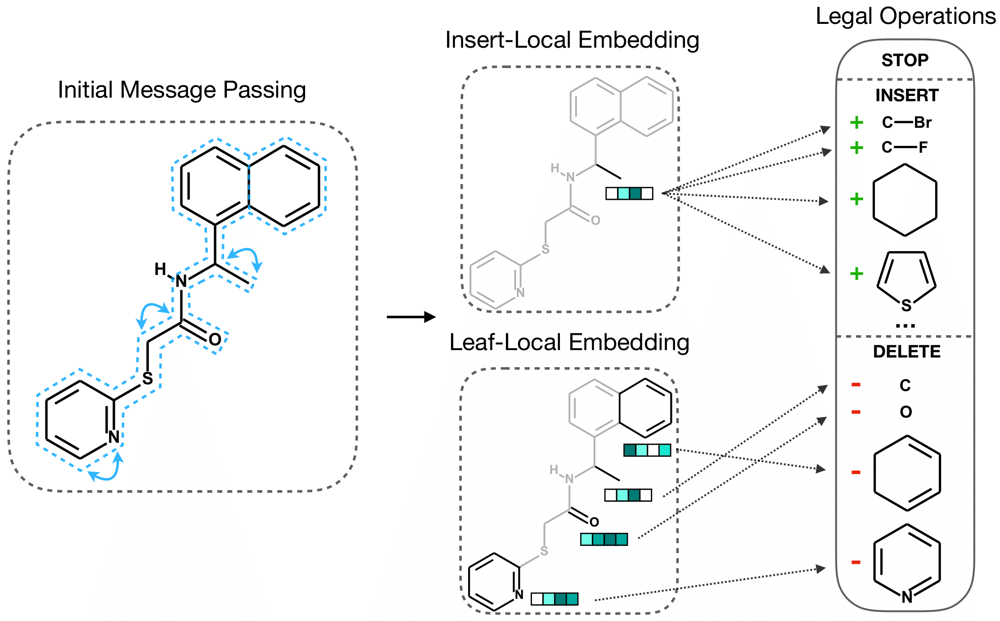

# Discrete Object Generation with Reversible Inductive Construction

This repository contains code and pre-trained models for the generative modeling framework described in (https://arxiv.org/abs/blahblah).

As opposed to building objects from scratch, the generative model is constructed via a Markov chain where each state corresponds to an object satisfying validity constraints for a given domain. Chain transitions consist of sampling from a fixed corruption distribution and a learned reconstruction distribution, each over short sequences of *legal* (validity-preserving) object modification steps. Applications to both molecules and Laman graphs are presented in the paper and implemented here.

## Code
Please see the README in `code/` for details.

## Authors:
* [Ari Seff](http://www.cs.princeton.edu/~aseff/)
* [Wenda Zhou](https://wendazhou.com/)
* [Farhan Damani](http://fdamani.com/)
* [Abigail Doyle](http://chemlabs.princeton.edu/doyle/people/about-abby/)
* [Ryan P. Adams](https://www.cs.princeton.edu/~rpa/)

Reach out to us with any questions!
